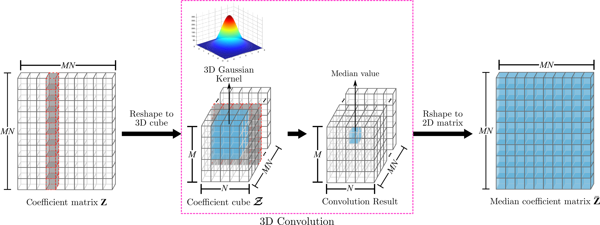

# Hyperspectral image segmentation using 3D regularized subspace clustering model

## Abstract
The accurate land cover segmentation of remotely sensed spectral images has widespread attention in the Earth observation and remote sensing fields. In the past decade, most of the efforts have focused on the development of different supervised methods for spectral image classification. However, the computer vision community is currently developing unsupervised methods that can adapt to new conditions without leveraging expensive supervision. Among unsupervised classification methods, Sparse Subspace Clustering (SSC) has become a popular tool and has achieved good clustering results on experiments with real data. However, the SSC model does not take into account the spatial information contained in the spectral images; thus, limiting its discrimination capability, and hampering the spatial homogeneity of the clustering results. To address such issue, this paper proposes to incorporate a regularization term to the SSC model, which takes into account the neighboring spatial information of spectral pixels in the scene. Specifically, since spectral pixels belonging to the same land cover material are arranged in common regions, we use a 3D Gaussian filter to perform a 3D convolution on the sparse coefficients, obtaining a piecewise-smooth representation matrix which is used to enforce an averaging constraint in the SSC optimization program. Extensive simulations demonstrate the effectiveness of the proposed method, achieving overall accuracies of 80.41%, 88.26%, and 100% in selected regions of the Indian Pines, Salinas, and University of Pavia hyperspectral datasets.

## Workflow
The proposed methodology to enhance the sparse representation coefficients matrix using 3D convolution is depicted in the following picture.

This repository contains the MatLab codes of this paper.

## Authors

* **Carlos Hinojosa** - [GitHub](https://github.com/carlosh93) - [WebPage](https://carloshinojosa.me/) - [Scholar](https://scholar.google.com/citations?hl=es&user=KP02_jwAAAAJ)

